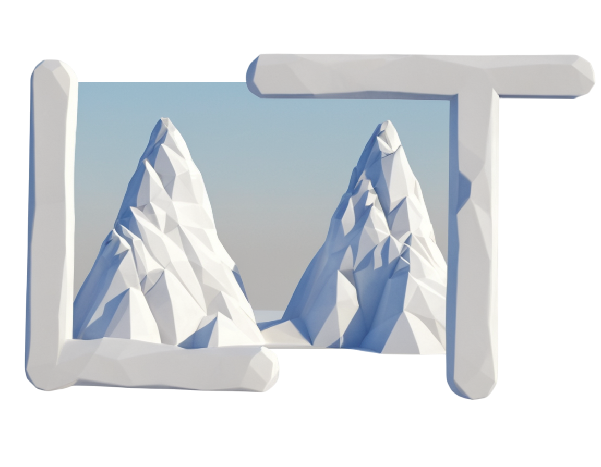

<p align="center">

<h1 align="center"><b>L</b>arge Language Model <b>A</b>ligned <b>A</b>ttribution <b>T</b>raining (<b>LAAT</b>)</h1>

</p>
<p>
  <a href="https://www.gnu.org/licenses/gpl-3.0.en.html" target="_blank">
    
  </a>
</p>

Use LLMs as training regularizers for small models and significantly improve their generalization ability.


## Quickstart 🚀

```python
from laat.datasets import LAATDataset
from laat.splitters import NShotSplitter
from laat.models.laat import LAATLAATModel, LAATClassifier, TorchLogisticRegression
from langchain_openai import ChatOpenAI


# load the dataset
dataset = LAATDataset("breast-ljubljana", "laat/data")
# split it into k-shot
X_train, X_test, y_train, y_test = NShotSplitter.split(dataset.X, dataset.y, shot=5)

# define training parameters
model_kwargs = {
    "lr": 1e-2,
    "max_epochs": 200,
    "train_split": None,
    "optimizer": torch.optim.Adam,
    "optimizer__weight_decay": 1e-2,
    "verbose": False,
    "device": "cuda",
}

# instantiate the model
model = LAATLAATModel(
            model_name=f"laat_gpt-4o-mini_lr",
            model_class=partial_class(
                LAATClassifier,
                module=TorchLogisticRegression,
                **model_kwargs,
                ),
            pandas_to_numpy_mapper=dataset.to_numpy,
            dataset=dataset,
            reasoning_llm=ChatOpenAI(model="gpt-4o-mini"),
            parsing_llm=ChatOpenAI(
                model="gpt-4o-mini",
                temperature=0.0,
                ),
            gamma=100.0,
            n_estimates=5,
        )

# train the model
model.train(X_train, y_train)
```

## Author

👤 **Davor Vukadin**

* Github: [@davor10105](https://github.com/davor10105)
* LinkedIn: [@https:\/\/www.linkedin.com\/in\/davor-vukadin-596aaa1b7\/](https://linkedin.com/in/https:\/\/www.linkedin.com\/in\/davor-vukadin-596aaa1b7\/)
